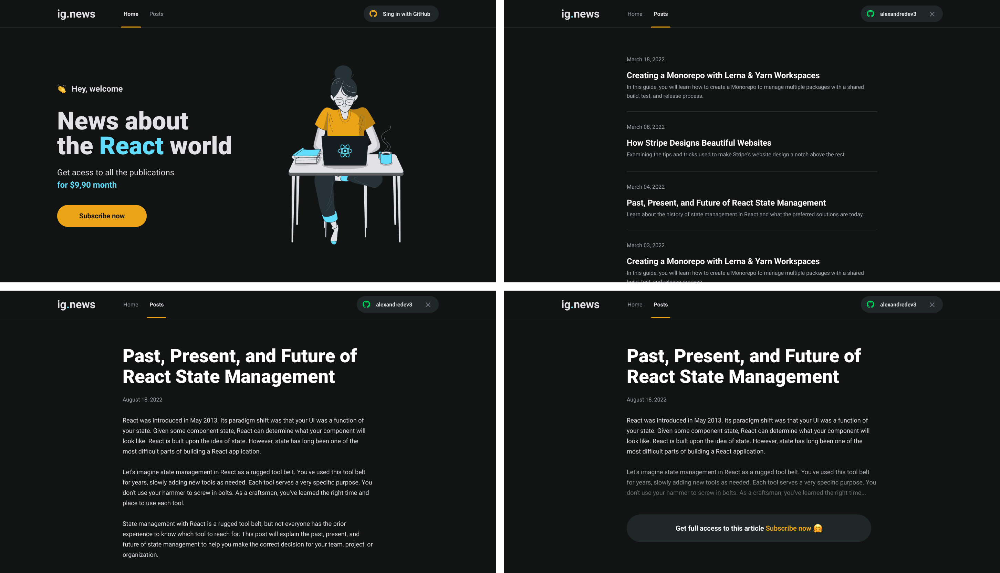

<h1 align="center">
  
  <br />
  <a href="https://www.linkedin.com/in/alexandre-costa-401699199">
    
  </a>
  <a href="https://github.com/alexandredev3/ignews/issues">
    
  </a>
  <a href="https://github.com/alexandredev3/ignews/issues?q=is%3Aissue+is%3Aclosed">
    
  </a>
  <a href="https://github.com/alexandredev3/ignews/network">
    
  </a>
  <a href="https://github.com/alexandredev3/ignews/stargazers">
    
  </a>
</h1>


## :page_facing_up: About
Ignews is a news platform to which the user have to subscribe to have full access to the articles.

## 🛠 Tools
Those are the tools used to build the app:

- [Typescript](https://www.typescriptlang.org/)
- [React.js](https://reactjs.org/)
- [Next.js](https://nextjs.org/)
- [Sass](https://sass-lang.com/)
- [Next Auth](https://next-auth.js.org/)
- [FaunaDB](https://fauna.com/)
- [Prismic CMS](https://prismic.io/)
- [Stripe](https://stripe.com/en-br)

## :clipboard: Features
- [x] Sign-In/Sign-Out with Github.
- [x] Subscribe.
- [x] Read article preview.
- [x] Read the full article if the user subscribe.

## :closed_book: Getting Started
1. Clone the repository
```bash
$ git clone https://github.com/alexandredev3/ignews.git
```

2. Install the dependencies
```bash
$ yarn install
```

3. Add values to the .ENV variables, see `.env.example` file.

4. Run the dev server and have fun!😊
```bash
$ yarn dev
```

## :man: Author

<a href="https://github.com/alexandredev3/">
 
 <br />
 <sub><b>Alexandre Costa</b></sub>
</a>

Made with :heart: by Alexandre C.🚀

<a href="https://www.linkedin.com/in/alexandre-costa-dos-santos">
  
</a>


## :memo: License

Copyright © 2020 [Alexandre Costa](https://github.com/alexandredev3).<br />
This project is [MIT](./LICENSE.txt) licensed.
